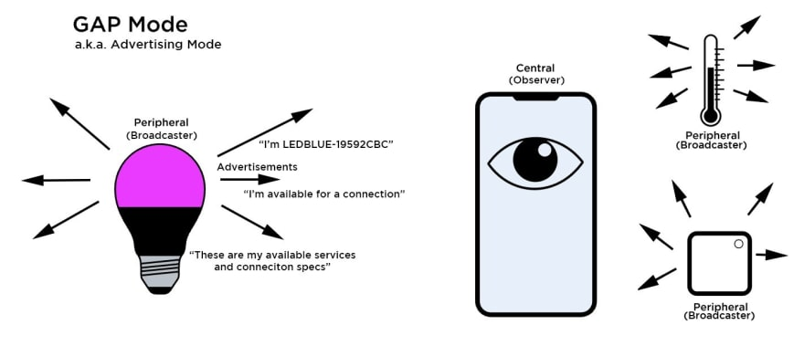

# A Quick Introduction to Bluetooth LE

Consumer Bluetooth devices that most of us are familiar with such as Bluetooth speakers, headsets, hands-free kit are considered Bluetooth Classic devices. These tends to either be externally powered or battery powered but with short shift life.

Bluetooth devices such as wearable, smart IoT, fitness monitoring devices are considered Bluetooth Low Energy devices. These tends to be battery powered with long shift life (we are talking about months, even years).

Bluetooth Low Energy was formerly known as [Wibree](https://en.wikipedia.org/wiki/Bluetooth_Low_Energy), a technology developed by Nokia and it's partners. In 2010, Bluetooth SIG merged with Wibree and renamed it Bluetooth LE. In the same year Bluetooth 4.0 was released and include both *Bluetooth Classic* and *Bluetooth LE*.

Note that while Bluetooth 4.0 (and later versions) supports both Bluetooth technology, they are not compatible. This means two devices communicating via Bluetooth must use the same technology (either Bluetooth Classic or Bluetooth LE).

There are two mandatory services for Bluetooth LE, Generic Access Profile (GAP) and Generic Attribute Profile (GATT). My interpretation is that when we talk about GAP, we are talking about Bluetooth LE connection behaviours. When we talk about GATT, we are talking about Bluetooth LE application behaviours.

### Generic Access Profile (GAP)

 *Source: adafruit.com*

The GAP service determines the device's visibility to the outside world as well as the role of the device in a Bluetooth network.

In the context of the GAP service, the device will either be a peripheral device or a central device. However, I believe the Bluetooth 4.1 spec indicates that a devices can be both at the same time (e.g. A smart phone can act a a central device w.r.t a smart bulb while at the same time act as a peripheral device w.r.t a desktop computer).

The GAP service defined 2 modes that a device can be in:
* Advertising/discovery mode
* Connected mode

The GAP service also defined 4 roles that a device can act as:
* Broadcaster
* Observer
* Peripheral
* Central

How a device behave depends on the mode it is in and the role it is acting as. Take the smart bulb and smart phone for example. Given the scenario where the bulb is not connected to the phone, both the bulb and the phone will be in advertising/discovery mode. The bulb will act as the Peripheral and the phone will act as the Central. The bulb will be broadcasting advertising packets with a connectable flag so that on receipt of the advertisement packets, the phone can initiate a persistent connection with the bulb.

At this point, the connection is considered *created* and the bulb is now referred to as the *slave* while the phone is referred to as the *master*. After a defined period of time (called the connection interval) the master sends a data packet and the slave will respond with a data packet. At this point, the connection is now considered *established*

Note that in the case if the bulb is broadcasting non-connectable advertising packets, the phone will not be able to connect to the bulb. In this scenario, the bulb is acting as a Broadcaster role and the phone is acting as an Observer role.

### Generic Attribute Profile (GATT)

Once the connection is established, we refer to the peripheral device as the *GATT Server* and the central device as the *GATT Client*.

 *Source: MediaTek Labs*

I think in order for us to understand how GATT and therefore Bluetooth LE works, it is important to explore a little bit about the GATT Server and the GATT Client.

Basically, a GATT Server contains a table of *attributes* which it exposes to the GATT Client to access (read/update).

The communication between a GATT Client and GATT Server can be summarised as follow:
* Query request from client to server.
* Update request from client to server, response from server required.
* Update request from client to server, response from server not required.
* Update notification from server to client, acknowledgement from client required.
* Update notification from server to client, acknowledgement from client not required.

Each record in the table represent an attribute (a property associated with the GATT Server) and has the following structure:

 *Source: oreilly.com*

* The *Handle* is a unique identifier used by the client to access the attribute.
* The *Type* indicates what type of attribute it is (because everything on the GATT server is exposed as an attribute).
* The *Permissions* indicates the accessibility of the attribute.
* The *Value* is the variable length value of the attribute.
* The *Value Length* indicates the number of bytes for the attribute value. 

Now that we have a better understanding of how data are stored on the GATT Server, let's explore GATT in details.

GATT allows the table of attributes which we have just discussed previously to be organised in a well defined hierarchical data structure.

At the top of the hierarchical data structure, we have a profile. Every attributes must be encapsulated within a profile. Data attributes are encapsulated within characteristic containers. A characteristic container includes metadata about the data attributes as well as data itself. Characteristics can also be logically grouped together as a service. A profile can contain one or more GATT services.

 *Source: adafruit.com*

---
That's it, hope you 'll find that useful.

Chris.