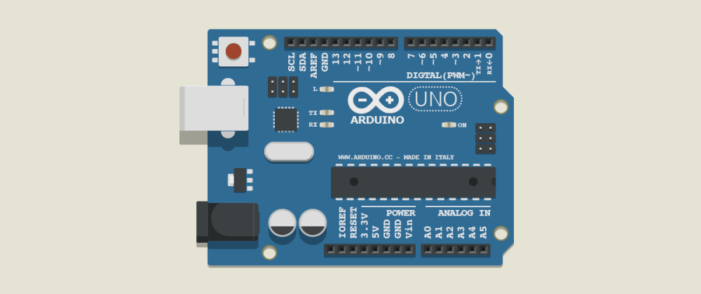
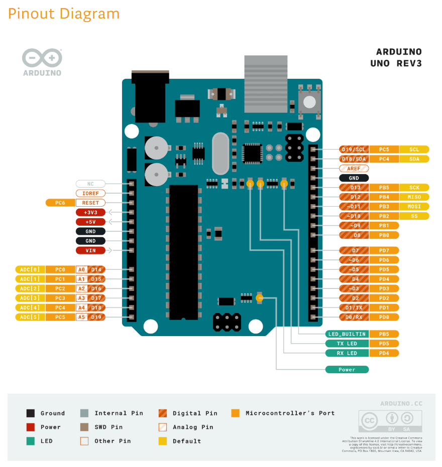
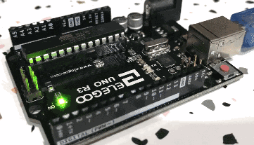

# Controlling the Arduino Uno Built-In LED

This post is really just a quick and easy exercise at dipping our toes into the Arduino world.

If you are like me who never played around with an Arduino before, I definitely recommend this [video](https://youtu.be/_ItSHuIJAJ8) just to get a bit familiarised with it.

If we look at the pinout diagram below, there are 4 LEDs on the board:
* LED_BUILTIN
* TX LED
* RX LED
* POWER

 *Source: arduino.cc*

What we are going to do is create a little program to make the builtin LED blinks (I believe the Arduino people call it a *sketch*) and flash it to our board.

Let's start by installing the Arduino IDE onto our development machine. It can download an official copy from [here](https://www.arduino.cc/en/Main/Software).

When we starts up the IDE, it opens with an blank sketch. But what's great is that it comes pre-loaded with a vast selection of sketches to get things moving. In our case, there is already a sketch to do exactly what we want called *Blink* which can be found under the *Basics Built-In Examples*.


I have also updated the sketch to use millis() instead of delay() since delay() actually pauses the program which is not what I wanted to do.

```cpp
static void SetLedState(bool state)
{
  if (state)
  {
    digitalWrite(LED_BUILTIN, HIGH);
  }
  else
  {
    digitalWrite(LED_BUILTIN, LOW);
  }
}

void setup()
{
  pinMode(LED_BUILTIN, OUTPUT);
  digitalWrite(LED_BUILTIN, LOW);
}

void loop()
{
  unsigned int secondsSinceBoot = millis() / 1000;

  if (secondsSinceBoot % 2 != 0)
  {
    SetLedState(true);
  }
  else
  {
    SetLedState(false);
  }
}
```

After that, all that's needed to be done is connect the USB cable, set the correct COM port and load it onto the Arduino Uno.



---
That's it, hope you 'll find that useful.

Chris.