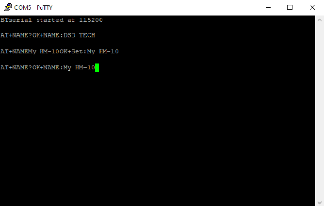

# Getting HM-10 BLE Up & Running with Arduino Uno

Sometime ago I got myself a HM-10 BLE module from Amazon. The one I got was manufactured by DSD Tech and it's datasheet can be found on their website [here](http://www.dsdtech-global.com/2017/08/hm-10.html).


This HM-10 comes with a breakout board which exposes the following pins:
* VCC
* GND
* TXD
* RXD

What we are going to do is connect these pins up to an Arduino Uno and then use the Arduino Serial Monitor to talk to the HM-10 and vice versa.

### The Physical Connection and Wiring


Note that the Arduino's digital pin output is 5V when high while the HM-10's RXD pin takes 3.3V. So we used a voltage divider to bring the 5V down to 3.3V before feeding it to the RXD pin.

##### The Software stuff

For the given Arduino setup above, load the following sketch to the Arduino (note that the sketch has a dependency to `AltSoftSerial` so that needs to be added to the Arduino library).

```cpp
/*
 * BTserialDemo: A simple demo of sending and receiving data between serial monitor
 *               and HM-10.
 * 
 * References: https://www.pjrc.com/teensy/td_libs_AltSoftSerial.html
 *             http://www.martyncurrey.com/hm-10-bluetooth-4ble-modules/
 *
 * Copyright Chris Dinh 2020
 */

#include <AltSoftSerial.h>

static AltSoftSerial btSerial;

/* There is data waiting to be read from the HM-10 device. */
static void HandleRxDataIndication(void)
{
   char c = btSerial.read();

   /* Just echo the character for now. */
   Serial.write(c);
}

/* There is data waiting to be sent to the HM-10 device. */
static void HandleTxDataIndication(void)
{
   char c = Serial.read();

   /* Echo the character just been sent. */
   Serial.write(c);

   /* We don't send carriage return or line feed. */
   if (c == 0x0A || c == 0x0D)
   {
      return;
   }

   btSerial.write(c);
}

void setup()
{
   Serial.begin(9600);
   btSerial.begin(9600);
   Serial.println("BTserial started at 115200");
}

void loop()
{
   if (btSerial.available())
   {
      HandleRxDataIndication();
   }

   if (Serial.available())
   {
      HandleTxDataIndication();
   }
}
```

Ok I think we have done all the setup that needs doing, time for a couple of demos.

##### Advertising Mode

When the HM-10 is in advertising mode, we can send AT commands to query or configure it.


In the diagram above, via the USB cable, the PC is powering the Arduino, which in turn powers the HM-10.

Using a terminal console (I am using Putty connected to the Arduino assigned COM port) we can query the device name currently assigned to the HM-10 using the AT command:
```shell
AT+NAME?
```

We can assign a new name to the HM-10 by replacing the question mark with a new name e.g:
```shell
AT+NAMEMy HM-10
```

If we query the device name again we would expect it to update to `My HM-10`.



##### Connected Mode

When the HM-10 is in connected mode, it acts as a pipe for data to be transferred between the Arduino and the Bluetooth device the HM-10 is connected to. In my case, I am using [nRF Connect](https://www.nordicsemi.com/Software-and-tools/Development-Tools/nRF-Connect-for-mobile).


The setup is exactly as before with the addition of the mobile phone with **nRF Connect** installed.


Using nRF Connect we should be able to see the HM-10 and connect to it.


Once connected, we can navigate to the services view. Here we see the services and characteristics provided by the HM-10. The one that we really interested in is the characteristic with the UUID `FFE1`. Note the properties i.e. Read, Write Without Response, and Notify. So in terms of our setup, if we click on the right-most button (triple down arrow) we requested the HM-10 to notify us of the string it received from the Arduino when the user entered it in the console terminal. Similarly, if we click on the middle button (up arrow) we can send a string to the HM-10 which would in turn get printed in the console terminal.

---
That's it, hope you 'll find that useful.

Chris.