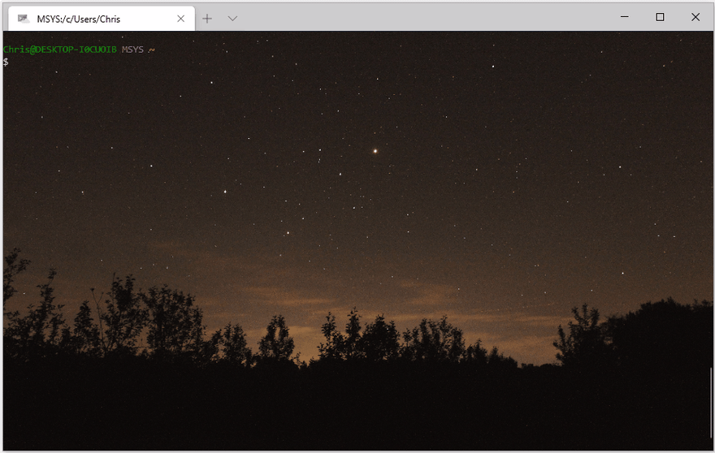
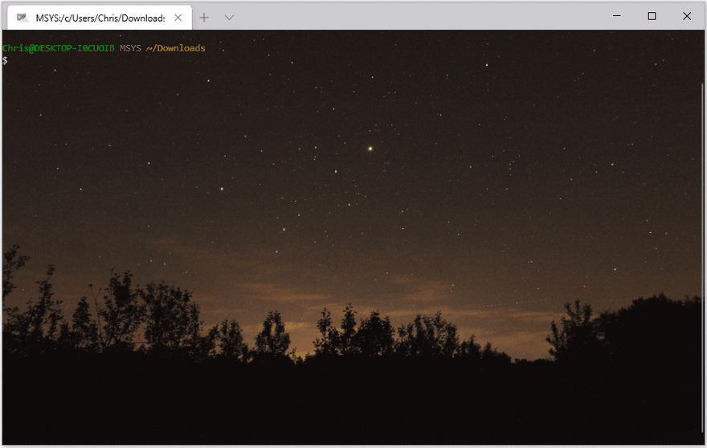
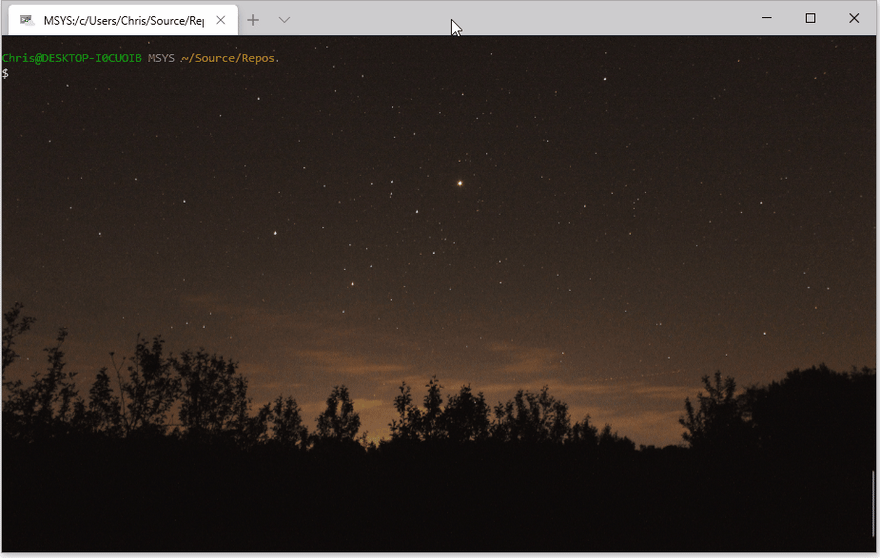

# Getting .NET Core 3.1 Up & Running on a Linux-Based Headless Device

> [.NET Core](https://dotnet.microsoft.com/) is a free and open-source software framework for Windows, Linux, and macOS operating systems. It is a cross-platform successor to .NET Framework.

The scenario is I want to run some .Net Core applications on my Linux device. The device in tucked away but within my local network to I can *ssh* into it if need to.

There's 2 obvious way of deploying the apps:
1. As a self-contained app with all the .NET Core dependencies needed to run. But we will be looking at a 75MB application that print out "Hello World!" (35MB for a trimmed down version).
2. As a Framework Dependent Deployment app which requires the .NET Core runtime to be available on the Linux device. We will be looking at an app with a few KB in size.

Since I own the Linux device and have no reason not to install the .NET Core runtime, there is no benefits for me to deploy a self contained app.

Also note that there 2 flavours of the .NET Core runtime, one with and one without ASP.NET Core support. I have no intention to host any web application at this point so I opted for the one without.

Right, lets get our hands dirty.

As we can see after *ssh* into my Linux device, executing the *dotnet* command does not work.

At the time of this writing, I wasn't able to install the runtime using package manager so I download the binary directly from [here](https://dotnet.microsoft.com/download/dotnet-core/3.1). For my device I downloaded *.NET Core Runtime 3.1.6, Linux ARM64* version.

After downloading the binary (currently in a tar.gz file format), I go to the download folder and use *sftp* to copy it to my Linux device.

Now I ll *ssh* back in and unzip the binary.

I also need to make sure that the operating system knows where to find the .NET Core runtime binary. After that I expect we are all set as we can see, executing *dotnet* command is working.

---
That's it, hope you 'll find that useful.

Chris.