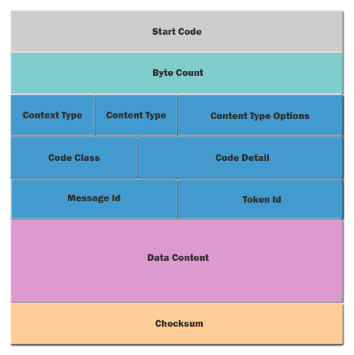
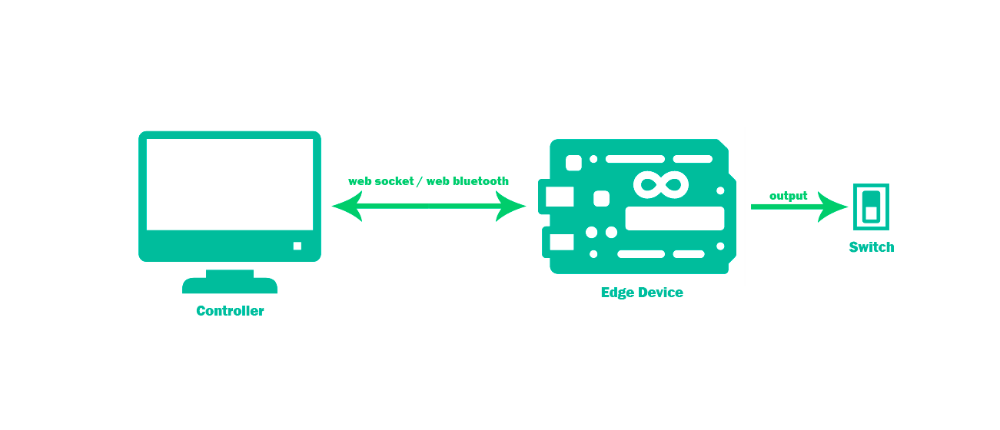

# Getting Started With Javascript Typed Arrays

In the age of IoT (Internet of Things), there is this notion where we want to be able to communicate with everything. Everything from simple sensors, security cameras, smart watches to smart phones, computers and cloud services. When I think of IoT devices I tend to think of them as simple devices with constraint resources and communicating over low bandwidth data channels, and given the constraint environment these IoT devices may operate in, data communication and processing tends to be a little bit more optimised down to the bit level. In JavaScript, `Typed Arrays` provide a mechanism for accessing raw binary data and process it at the bit level.

In this tutorial we will be using [SMoS](https://github.com/ChrisDinhNZ/SMoS) to demostrate the concept of typed arrays. `SMoS` is a small protocol I created for the purpose of learning and tinkering with IoT.

### Typed Array Basics

To understand how Javascript typed array works, there are two concepts which I think we need to understand:
* ArrayBuffer
* Views

`ArrayBuffer` can be described as a block of fixed-length contiguous binary data. It is purely a sequence of 0's and 1's without any context (we cannot interact with the data inside the buffer directly).

We normally create an ArrayBuffer as follows, where `n` is the number of bytes in the buffer:

```javascript
let buffer = new ArrayBuffer(n);
```

`Typed array views` can be described as stencils we place on top of the buffer to give it a context.


In the diagram above, we basically have an unsigned 8-bit integer array with 16 elements. The code will be something as follows:

```javascript
let buffer = new ArrayBuffer(16);
let uint8View = new Uint8Array(buffer);

for (let i = 0; i < uint8View.length; i++) {
  uint8View[i] = i;
}
```

### Introduction to SMoS

`SMoS` is a REST based messaging protocol, allowing 2 connected endpoints to communicate in the form a hex strings. The structure of a SMoS protocol data unit (PDU) is as follows:



The message structure basically consists of 3 parts:
* The header
* The payload
* The Checksum

The `header` provides the receiver of the message with the context to correctly process the message.

The message may contain additional `payload` required to process the message.

The `checksum` is used purely for the purpose of checking the message's data integrity.

### A Real World Example



Let's take a look at a real world example with the following components:
* `Controller` - A Javascript client connected to an edge device
* `Edge Device` - An Arduino board that acts as a gateway between the digital world and the analog world
* `Switch` - A relay that is coupled to a GPIO line on the Arduino

From the perspective of the Edge Device, the Switch is a resource that can be queried and controlled and have been assigned a resource ID of `0x01`.
For example, the Controller can ask for the state of the switch by sending the the hex string `:0100011001ED`. The Edge Device in turn will respond with something like `:02804510010127` indicating the switch is on. For more details on how the hex strings was derived, you can have a look at [SMoS Defined](https://github.com/ChrisDinhNZ/SMoS/blob/master/smos_defined.md) and [SMoS Generic Content Example](https://github.com/ChrisDinhNZ/SMoS/blob/master/smos_generic_content_example.md).

For the sake of this tutorial, I will focus on how we can use typed arrays to encode the SMoS message to query the state of the switch and decode the response.

### Typed Array in Action

#### The SMoS message to query the state of the switch, as a PDU is as follows:

| Byte Index | Bit 7 | Bit 6 | Bit 5 | Bit 4 | Bit 3 | Bit 2 | Bit 1 | Bit 0 | Hex Value |
| --- | --- | --- | --- | --- | --- | --- | --- | --- | --- |
| 0 | 0 | 0 | 1 | 1 | 1 | 0 | 1 | 0 | 0x3A |
| 1 | 0 | 0 | 0 | 0 | 0 | 0 | 0 | 1 | 0x01 |
| 2 | 0 | 0 | 0 | 0 | 0 | 0 | 0 | 0 | 0x00 |
| 3 | 0 | 0 | 0 | 0 | 0 | 0 | 0 | 1 | 0x01 |
| 4 | 0 | 0 | 0 | 1 | 0 | 0 | 0 | 0 | 0x10 |
| 5 | 0 | 0 | 0 | 0 | 0 | 0 | 0 | 1 | 0x01 |
| 6 | 1 | 1 | 1 | 0 | 1 | 1 | 0 | 1 | 0xED |

As previously mentioned, the message consists of 3 parts:
* The header, i.e. always 5 bytes
* The payload, in this case 1 byte indicating the resource to be queried
* The Checksum, always 1 byte, is the two's complement of the least significant byte (LSB) of the sum of all byte values in the message, excluding the `Start Code` (the first byte)

Therefore we need a buffer of 7 bytes.

```javascript
let buffer = new ArrayBuffer(7);
```

Now create some views so we can manipulate the buffer.

```javascript
let headerView = new Uint8Array(buffer, 0, 5);    // Access to first 5 bytes
let dataView = new Uint8Array(buffer, 5, 1);      // Access to 6th byte
let checksumView = new Uint8Array(buffer, 6, 1);  // Access to 7th i.e. last byte
```

Now we will start populating the header. Since we already know what the PDU looks like, I am just going to cheat and copy the data into the header.

```javascript
headerView[0] = 0x3A;
headerView[1] = 0x01;
headerView[2] = 0x00;
headerView[3] = 0x01;
headerView[4] = 0x10;
```

But if we were to create the PDU from scratch, there will definitely be some bit masking and shifting that needs to be done. For example if we look back at the PDU structure, the message ID is the 4 most significant bits (MSB) of the 5th byte. So in order to assign the message ID to the PDU we would need to do something like:

```javascript
let messageId = 1;
let messageIdMask = 0xF0;
let messageIdOffset = 4;

headerView[4] = (messageId << messageIdOffset) & messageIdMask;
```

Now populate the payload.

```javascript
dataView[0] = 0x01;
```

Let's calculate the checksum just to proof the data integrity is intact (i.e. the checksum should be 0xED).

```javascript
let sumValue = 0;

/* Note that we don't include the start code when calculating the checksum. */
for (let i = 1; i < headerView.length; i++) {
  sumValue += headerView[i];
}

sumValue += dataView[0];
checksumView[0] = (~sumValue + 1) & 0xFF;
```

If we do a `console.log(checksumView[0])` we should get 237 (which is the same as 0xED).

Now let's create a function to convert our SMoS PDU to a hex string.

```javascript
function SmosPduToHexString(arrayBuffer) {

  startCodeView = new Uint8Array(arrayBuffer, 0, 1);
  pduContentView = new Uint8Array(arrayBuffer, 1, arrayBuffer.byteLength - 1);

  return String.fromCharCode(startCodeView[0]) + Array.prototype.map.call(pduContentView, function(byte) {
    return ('0' + (byte & 0xFF).toString(16)).slice(-2);
  }).join('');
}
```

Now if we do `console.log(smosPduToHexString(buffer))` we should get the resulting hex string `:0100011001ed`

#### The SMoS message received from the Edge Device indicating the switch is on, as a hex string is as follows:

`:02804510010127`

We will now decode this hex string by converting it a SMoS PDU, so let's create a function to do that.

```javascript
/* This function will return an empty array buffer if it fails to succesfully decode the string. */
function HexStringToSmosPdu(hexString) {

  const SMOS_HEX_STRING_MIN_LENGTH = 11;
  const emptyArrayBuffer = new ArrayBuffer();

  const hexStringWithoutStartCode = hexString.substring(1, hexString.length);

  /* Hex string must start with the ':' char */
  if (hexString.charAt(0) != ':') {
    console.log('WARNING: start code not found');
    return emptyArrayBuffer;
  }

  /* Valid hex string must have at least minimum length. */
  if (hexString.length < SMOS_HEX_STRING_MIN_LENGTH) {
    console.log('WARNING: minimum string length not met');
    return emptyArrayBuffer;
  }

  /* Hex string (excluding the start code) must have even number of characters since each
     byte requires 2 digits. */
  if (hexStringWithoutStartCode.length % 2 != 0) {
    console.log('WARNING: unexpected string length');
    return emptyArrayBuffer;
  }

  /* Hex string (excluding the start code) must contain hex digits only */
  if (hexStringWithoutStartCode.match(/[G-Z\s]/i)) {
    console.log('WARNING: found non-hex characters');
    return emptyArrayBuffer;
  }

  /* Convert to PDU content byte array */
  const pairs = hexStringWithoutStartCode.match(/[\dA-F]{2}/gi);
  const integers = pairs.map(function(s) {
    return parseInt(s, 16);
  });

  /* Put start code and PDU content into array buffer. */
  let arrayBuffer = new ArrayBuffer(integers.length + 1);
  let startCodeView = new Uint8Array(arrayBuffer, 0, 1);
  let pduContentView = new Uint8Array(arrayBuffer, 1, arrayBuffer.byteLength - 1);

  startCodeView[0] = hexString.charCodeAt(0);

  for (let i = 0; i < pduContentView.length; i++) {
    pduContentView[i] = integers[i];
  }

  /* Now that we have converted the hex string to SMoS PDU, we 'll check it's data integrity. */
  let sumValue = 0;

  /* The following for loop will sum up the PDU byte values excluding the start code and the checksum. */
  for (let i = 0; i < pduContentView.length - 1; i++) {
    sumValue += pduContentView[i];
  }

  calculatedChecksum = (~sumValue + 1) & 0xFF;

  if (calculatedChecksum != pduContentView[pduContentView.length - 1]) {
    console.log('WARNING: bad checksum');
    return emptyArrayBuffer;
  }

  /* We are good to go. */
  return arrayBuffer;
}
```

Now if we put the the hex string we received from the Edge Device through the decoder function e.g.

```javascript
let result = HexStringToSmosPdu(":02804510010127");
```

we should get a PDU as follows:

| Byte Index | Bit 7 | Bit 6 | Bit 5 | Bit 4 | Bit 3 | Bit 2 | Bit 1 | Bit 0 | Hex Value |
| --- | --- | --- | --- | --- | --- | --- | --- | --- | --- |
| 0 | 0 | 0 | 1 | 1 | 1 | 0 | 1 | 0 | 0x3A |
| 1 | 0 | 0 | 0 | 0 | 0 | 0 | 1 | 0 | 0x02 |
| 2 | 1 | 0 | 0 | 0 | 0 | 0 | 0 | 0 | 0x80 |
| 3 | 0 | 1 | 0 | 0 | 0 | 1 | 0 | 1 | 0x45 |
| 4 | 0 | 0 | 0 | 1 | 0 | 0 | 0 | 0 | 0x10 |
| 5 | 0 | 0 | 0 | 0 | 0 | 0 | 0 | 1 | 0x01 |
| 6 | 0 | 0 | 0 | 0 | 0 | 0 | 0 | 1 | 0x01 |
| 7 | 0 | 0 | 1 | 0 | 0 | 1 | 1 | 1 | 0x27 |


From the SMoS definition:
* Byte at index 4 indicates the message ID, this should match the message ID of the request from the controller.
* Byte at index 5 indicates the resource ID, this should match the resource requested by the controller.
* Byte at index 6 indicates the swtich is on (i.e. 0x01), otherwise 0x00 if the switch is off.

Anyway, I am glad I got a chance to dig into array buffers. I think it's awesome as it makes it easy to talk to IoT devices from a Javascript client at the bit level.

---
That's it, hope you 'll find that useful.

Chris.
